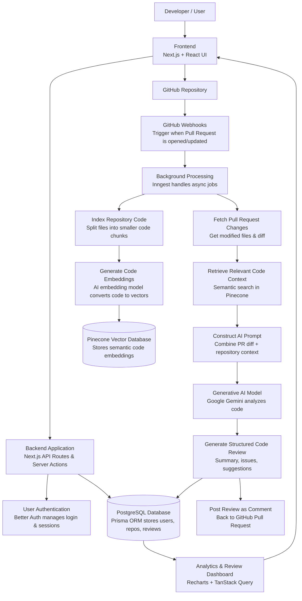

## Project Title

**RepoShield: Developed an AI-Powered Automated Code Review Platform with Integrated Application Security Auditing**

## Abstract

The proposed project is a comprehensive, sophisticated, AI-powered platform strategically designed to automate and enhance the modern software development lifecycle by revolutionizing the traditional code review process. In fast-paced development environments, manual code reviews frequently become a severe bottleneck, heavily reliant on senior engineers and prone to inconsistencies. To resolve this, the system integrates seamlessly with GitHub repositories, actively monitoring incoming pull requests and immediately employing advanced Generative Artificial Intelligence to intensely analyze all code modifications.

A major limitation of traditional automated tools is their tendency to scan changed files in isolation, completely missing crucial project-specific architectures. This platform overcomes such limitations by ingeniously utilizing a Retrieval-Augmented Generation (RAG) architecture. Powered by precise vector embeddings and a high-performance vector database, the system deeply indexes and comprehends the broader scope of the repository. This architectural advantage enables the AI to provide highly accurate, dynamically targeted feedback that perfectly aligns with the context of the entire codebase. 

Beyond reviewing code for structural quality, hidden bugs, and architectural design flaws, the system functions as a vital, automated application security auditor. It proactively analyzes pull requests to detect potential security vulnerabilities, threat vectors, and dangerous coding practices long before the flawed code is ever merged into production. Ultimately, this innovative solution significantly reduces the extensive time and effort required for manual reviews, drastically minimizes the risk of overlooked vulnerabilities, and ensures a demonstrably more secure, highly efficient, and consistent development workflow for collaborative engineering teams.

---

## Project Overview

- The proposed project aims to develop an AI-powered platform that automatically reviews pull requests in software repositories and provides intelligent feedback to developers.
- The system integrates Retrieval-Augmented Generation (RAG) and generative AI models to analyze code changes while considering the context of the entire repository.
- This project falls under the domain of Artificial Intelligence, Cloud-based Software Engineering, and DevOps Automation.
- With the rapid growth of collaborative development on platforms such as GitHub, efficient code review has become essential for maintaining code quality and security.
- The platform will assist developers, engineering teams, and organizations by providing automated, context-aware code review suggestions during the development lifecycle.

---

## Problem Statement

- Modern software development relies heavily on collaborative workflows where developers submit pull requests for integrating code changes.
- Manual code reviews are time-consuming, inconsistent, and highly dependent on the availability of experienced engineers.
- As software repositories grow larger and more complex, reviewers often lack full visibility of the entire codebase, leading to missed architectural inconsistencies, hidden bugs, and potential security vulnerabilities.
- Existing automated code review tools typically analyze only the modified files within a pull request, without understanding the broader repository context.
- This limitation results in shallow or incomplete feedback that may not accurately reflect the impact of the code changes. Consequently, development teams experience delays, reduced productivity, and inconsistent code quality.
- Therefore, there is a need for a scalable, intelligent system that can analyze pull requests with full repository context and generate structured, automated code reviews using advanced AI techniques.

---

## How the Problem Was Identified

- The problem was identified through observation of common challenges faced by developers during collaborative software development.
- In many teams, pull requests remain open for long periods due to delays in manual code reviews. Developers often depend on senior engineers for review feedback, creating bottlenecks in the development workflow.
- Further investigation revealed that existing automated tools provide limited contextual analysis because they evaluate only the changed files rather than the entire repository.
- Discussions within developer communities, technical blogs, and open-source forums also highlight the growing demand for intelligent developer tools that can assist with automated code analysis and review.
- These observations indicated the need for a more advanced system capable of providing context-aware insights during the code review process.

---

## Objectives

- Design a web-based platform that integrates with GitHub repositories to automatically monitor and analyze pull requests.
- Develop a context-aware code review system using Retrieval-Augmented Generation (RAG) to analyze code changes in relation to the entire repository.
- Implement generative AI models to generate structured review feedback including summaries, issue detection, and improvement suggestions.
- Build a repository indexing and semantic search mechanism using vector embeddings to enable contextual understanding of the codebase.
- Evaluate the effectiveness of the system in improving code review efficiency and supporting development teams.

---

## Proposed Solution

- **Platform & Integration**: Developed a web-based dashboard that connects to GitHub repositories and uses webhooks to automatically monitor and retrieve new code changes when pull requests are submitted.
- **Contextual Indexing**: Systematically index connected repositories by chunking source code and converting it into vector embeddings stored in a vector database (Pinecone) for semantic search.
- **RAG-Powered Retrieval**: Upon a new pull request, perform similarity search techniques against the vector database to retrieve the most relevant, repository-wide context related to the modified code.
- **AI-Driven Analysis**: Combine the pull request changes with the retrieved, broader repository context and process it through a generative AI model to produce comprehensive, structured code reviews (summaries, issues, suggestions).
- **Feedback & Visibility**: Store all generated reviews in the primary database for dashboard analytics, and optionally post the AI feedback directly as comments on the GitHub pull request for immediate developer visibility.

---

## Tech Stack

### Frontend

- Next.js
- React
- TypeScript
- Tailwind CSS
- shadcn/ui components

### Backend

- Next.js API Routes
- Node.js runtime
- Server Actions

### Databases

- PostgreSQL (primary database)
- Pinecone (vector database for embeddings)

### AI and Machine Learning

- Google Gemini AI
- Text embedding models for semantic search
- Retrieval-Augmented Generation (RAG)

### Integration and Infrastructure

- GitHub API (Octokit)
- Background job processing with Inngest
- Authentication with Better Auth

---

## Technology Integration

- The frontend of the system will be developed using Next.js and React, providing an interactive dashboard for repository management and review visualization.
- The backend will use Next.js API routes and Node.js to handle server-side logic, webhook processing, and communication with external services.
- PostgreSQL with Prisma ORM will manage application data such as users, repositories, and generated reviews.
- A Pinecone vector database will store code embeddings to enable semantic search and retrieval of relevant repository context.
- Google Gemini AI will analyze the pull request changes along with retrieved repository context to generate structured review feedback.
- GitHub APIs and webhooks will enable real-time integration with repositories and automated pull request monitoring.
- Background processing using Inngest will handle asynchronous tasks such as repository indexing and AI review generation.
- Together, these technologies will work in an integrated architecture to provide a scalable, automated, and context-aware code review system.

The system uses a Next.js frontend and backend to manage user interaction and API communication. GitHub webhooks trigger background jobs that process pull requests and retrieve repository context from a vector database. The retrieved context and code changes are analyzed using a generative AI model to produce structured code reviews, which are stored in the database and displayed in the dashboard.

### System Architecture

---

## Expected Outcomes

The project is expected to deliver a fully functional AI-powered code review platform capable of assisting developers during the pull request process.

Key outcomes include:

- A web-based platform that integrates with GitHub repositories for automated pull request analysis.
- An intelligent AI review system capable of generating structured feedback on code changes by understanding the broader repository architecture.
- Application Security Auditing - An integrated, automated security auditing system that proactively scans pull requests to detect potential security vulnerabilities, threat vectors, and dangerous coding practices long before flawed code is merged into production.
- A repository indexing system that enables semantic search and deep contextual understanding of the entire codebase.
- A dashboard for viewing review results, security audit reports, repository activity, and analytics.
- Improved development workflow efficiency by significantly reducing the time and effort required for manual code reviews.

---

## Market Research

Software development teams increasingly rely on automated tools to maintain code quality and improve productivity. Several platforms currently provide AI-assisted coding and review features.

For example:

| Platform | Primary Focus | Limitations Regarding Context-Aware Review |
|:---|:---|:---|
| **GitHub Copilot** | Assists developers in writing code | Provides limited automated review functionality. |
| **Amazon CodeGuru** | Focuses mainly on performance and security analysis | Lacks deep contextual repository understanding. |
| **Snyk** | Provides vulnerability scanning | Does not provide comprehensive architecture-aware review feedback. |

While these tools provide valuable assistance, most existing systems focus on individual code snippets or security scanning rather than holistic repository-level review.

This creates a gap for a solution that combines semantic repository understanding, automated pull request review, and AI-generated insights in a unified platform.

---

## V.E.T.S Justification

### V – Viability

- The project is feasible using available technologies such as the GitHub API, generative AI services, and vector databases, which provide the required infrastructure for development.
- The development team has experience in full-stack development and AI integration, making it possible to implement the system within the project timeline.

### E – Engineering Depth

- The project involves the implementation of a Retrieval-Augmented Generation (RAG) pipeline, including repository indexing, vector embeddings, and semantic search for context-aware code analysis.
- It requires integration of multiple system components such as AI models, GitHub APIs, databases, and background processing to automate pull request reviews.

### T – Trend Alignment

- The project aligns with the growing use of Artificial Intelligence and automation in software development tools to improve productivity and code quality.
- It utilizes modern technologies such as Generative AI and RAG architectures, which are widely adopted in advanced AI-driven systems.

### S – Social / Industrial Impact

- The system helps development teams reduce manual review workload and improve efficiency in the software development process.
- It contributes to better software quality by enabling early detection of issues and promoting consistent coding practices.

---

## Research Work

- Lewis, P. et al. (2020). *Retrieval-Augmented Generation for Knowledge-Intensive NLP Tasks.*
- Vaswani, A. et al. (2017). *Attention Is All You Need.*
- Official Documentation – GitHub
- Pinecone Vector Database Documentation
- Google Gemini AI Documentation
- Prisma ORM Documentation
- Next.js Official Documentation
- TanStack Query Documentation
- Octokit GitHub API Documentation
- Research articles on AI-assisted software development tools.
